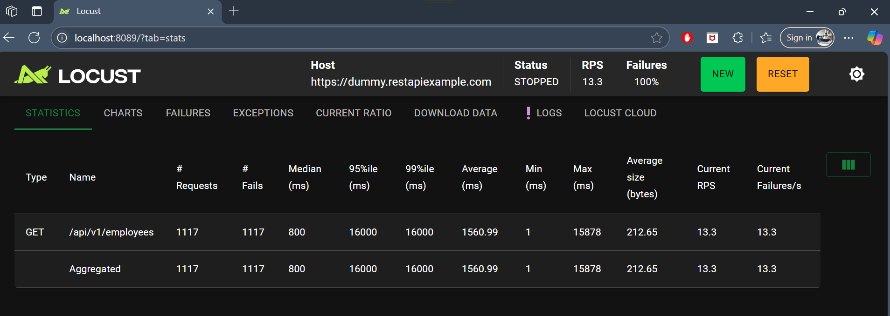

# python_locust_performance

#### git clone <repo_name>
#### git branch <branch_name>
#### git checkout <branch_name>

## Locust quickstart url -> https://docs.locust.io/en/stable/quickstart.html
# Installation and Running Locust
### pip install locust
### locust -f <locust_file>
### locust will run in the localhost default port : http://localhost:8089

